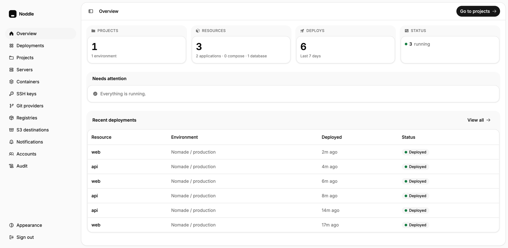
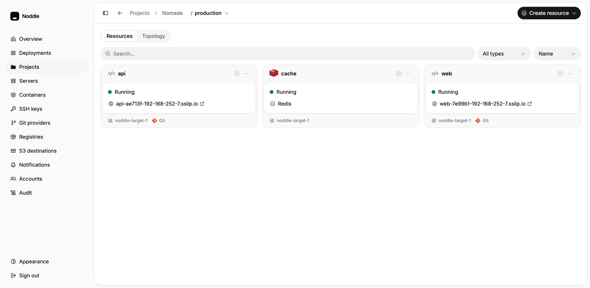

<div align="center">


# Noddle

**Deploy your applications and databases to a server you own, from a single dashboard.**

[](https://github.com/lucien-loua/noddle/actions/workflows/verify-unit.yml) [](https://github.com/lucien-loua/noddle/actions/workflows/spike.yml) [](./LICENSE)

[What it does](#what-it-does) · [Install](#install-it-on-a-server) · [Status](#status) · [How it is built](#how-it-is-built) · [Contributing](#contributing)

</div>

<br />



## What it does

Give it a repository and a server. It clones, builds an image **on that server**, runs it as a Docker Swarm service behind Traefik, and issues the certificate. Push to the branch and it does it again.

|  |  |
| --- | --- |
| **Applications** | Any stack Railpack detects, or your own Dockerfile. Built on your server, never on ours |
| **Databases** | Postgres, MySQL, MariaDB, MongoDB, Redis — provisioned, backed up, restorable |
| **Compose** | Deploy an existing `docker-compose.yml` as a stack |
| **Domains & TLS** | Traefik routing and Let's Encrypt certificates per resource |
| **Previews** | An ephemeral environment per pull request, from the same deploy path as production |
| **Backups** | Scheduled, to any S3-compatible bucket, with one-click restore |
| **Multi-server** | Add servers as Swarm workers and place resources across them |
| **Operations** | Live logs, metrics, a shell into any container, roles, an audit log, notifications |



## Install it on a server

One command on a fresh Linux machine — Debian or Ubuntu, 2 GB of RAM is enough:

```bash
curl -fsSL https://raw.githubusercontent.com/lucien-loua/noddle/main/installer/install.sh | bash
```

To reach the dashboard over HTTPS on your own domain, point an A record at the machine first, then pass it in:

```bash
curl -fsSL https://raw.githubusercontent.com/lucien-loua/noddle/main/installer/install.sh \
  | NODDLE_DOMAIN=noddle.example.com ACME_EMAIL=you@example.com bash
```

Without a domain it serves plain HTTP on the machine's IP address.

The script installs Docker if it is missing, turns the node into a Swarm manager, clones the sources into `/opt/noddle`, writes the generated secrets to `installer/.env` — **back that file up, it holds the key your secrets are encrypted with** — starts the control plane, runs the migrations, and registers the machine itself as target server #1. The first screen creates the administrator account.

|                 |                                                |
| --------------- | ---------------------------------------------- |
| `NODDLE_DOMAIN` | dashboard hostname; enables Let's Encrypt      |
| `ACME_EMAIL`    | contact address, required when a domain is set |
| `NODDLE_REF`    | branch or tag to install, default `main`       |
| `NODDLE_DIR`    | where the sources go, default `/opt/noddle`    |

## Status

The deploy loop works and has been run against real machines. Nothing has shipped a release yet.

|  |  |
| --- | --- |
| ✅ Works | deploy loop, multi-server, databases, Compose stacks, backups, previews, registry builds, RBAC, audit log, notifications |
| 🚧 Not built | CLI, teams and multi-tenancy |
| 🔬 Proven on | a Multipass VM at 2 GB, and a public VPS for the TLS path |
| ⚠️ Not proven | long-lived production. Nobody runs this for real yet, us included |

If you need something to rely on today, this is not it. If you want something to read and take apart, that part is ready.

## Run it locally, to work on it

```bash
bun install
bun run dev
```

`dev` checks its prerequisites, seeds `apps/*/.env` from the committed examples, brings up Postgres, Redis and S3 in Docker, applies migrations, then starts the dashboard and the worker. It answers on <http://127.0.0.1:3000>.

|                           |                                      |
| ------------------------- | ------------------------------------ |
| `bun run dev`             | the whole thing                      |
| `bun run dev:stack`       | Postgres, Redis, RustFS on their own |
| `bun run dev:stack:reset` | drop the volumes, recreate, migrate  |

**Deploying something needs a target server.** Local development gets one from a Multipass VM over real SSH — not Docker-in-Docker, and deliberately at 2 GB so build-cap OOMs are reproducible.

```bash
./scripts/spike-local.sh     # provision the VM and run the deploy chain on it
./scripts/adopt-local.sh     # register it as target server #1
```

## How it is built

```
apps/dashboard        dashboard (TanStack Start: UI + server functions)
apps/worker     BullMQ worker — build and deploy jobs
packages/       shared modules: db, ssh-executor, build-engine, …
installer/      install.sh and the production stack
```

`apps/dashboard` runs on Bun and `apps/worker` on **Node**, which is not a preference: `dockerode` over an SSH tunnel does not work on Bun, measured both ways. The worker loads its code once at startup, so a change to `build-engine` or `ssh-executor` does nothing until it restarts.

Three documents carry what the code cannot say on its own:

|  |  |
| --- | --- |
| [`CONTEXT.md`](./CONTEXT.md) | the domain glossary — what a Service, a Deployment, a Job mean here. Read this first |
| [`AGENTS.md`](./AGENTS.md) | code standards |
| [`.claude/CLAUDE.md`](./.claude/CLAUDE.md) | the settled decisions, each with what it cost to learn |

## Verifying

Suites live next to the module they cover, named `verify*.ts`, and each declares on its first line what it needs:

|  |  |  |
| --- | --- | --- |
| `bun run verify:pure` | nothing | every push, in CI |
| `bun run verify:local` | `bun run dev:stack` | Postgres, Redis, S3 |
| `bun run verify:vm` | `./scripts/spike-local.sh` | a real machine over SSH |

**Infrastructure code is not done when it typechecks.** Anything touching SSH, Swarm, Railpack or Traefik has to run against a real machine before it counts. If you cannot run it, say so in the pull request rather than implying it works — that is a normal thing to say here, not a failure.

## Contributing

Issues and pull requests are welcome, including ones that only ask a question.

```bash
bun run check       # oxlint + oxfmt, via Ultracite
bun run typecheck
bun run verify:pure
```

What helps a change land: one concern per commit with the _why_ in the message, new vocabulary added to `CONTEXT.md` in the same change, a `verify*.ts` alongside anything that could regress silently, and — for infrastructure — what you ran it against.

What gets pushed back: a dependency without a reason, config options nobody asked for, files scaffolded for later, and comments.

## Licence

[Apache-2.0](./LICENSE). Use it, modify it, self-host it, redistribute it, including in commercial and closed-source work. Contributions are taken under the same licence.
